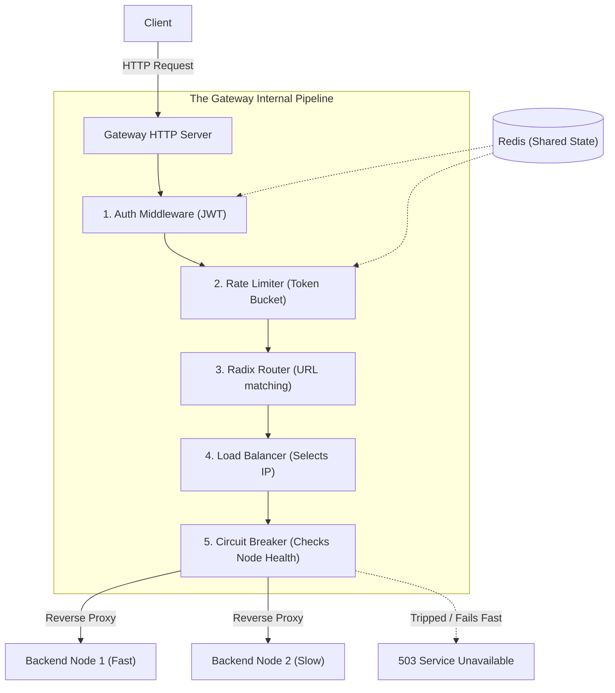

# api-gateway
Implementation of an API-gateway.

## What is an API Gateway?

> At its simplest, an API Gateway is a highly-concurrent reverse proxy. It intercepts client requests to improve security, performance, and reliability. Instead of every microservice duplicating logic for authentication, rate limiting, and load balancing, the Gateway abstracts those concerns away.

## High-Level Architecture

*Note: This diagram shows the request pipeline. We will evaluate traffic in this exact order to drop bad requests before wasting CPU on routing.*

## The Format

* **Presenters:** 20 minutes to describe an implementation of your topic. Highlight your architectural choices, trade-offs, and nuances.
* **My Job:** I will take your presentation, code the implementation, and open a PR before our next meeting for us to review and load-test.

## Syllabus (our Dev Flow)

*We build the core routing engine first, and then wrap it in resilience and security layers.*

1. **Proxying & Routing:** How does a reverse proxy actually stream data? How do we build an efficient Radix Tree for routing?
2. **Load Balancing:** Consider backends with varying speeds and traffic surges. Explain nuanced algorithms beyond basic Round Robin.
3. **Rate Limiting:** How do we limit users? Explain fixed rate vs. dynamic limits based on health checks. How do we implement a sufficiently nuanced algorithm efficiently in memory?
4. **Circuit Breaking:** Backends fail. How do we build a state machine to "fail fast" and protect the gateway from cascading TCP timeouts?
5. **Auth & Distributed State:** How do we validate 10k JWTs/sec AND share rate limit counts across replicas using Redis + Lua scripts?
6. **Observability & Tying it All Up:** How do we instrument our gateway with metrics (RED method) and distributed tracing?
