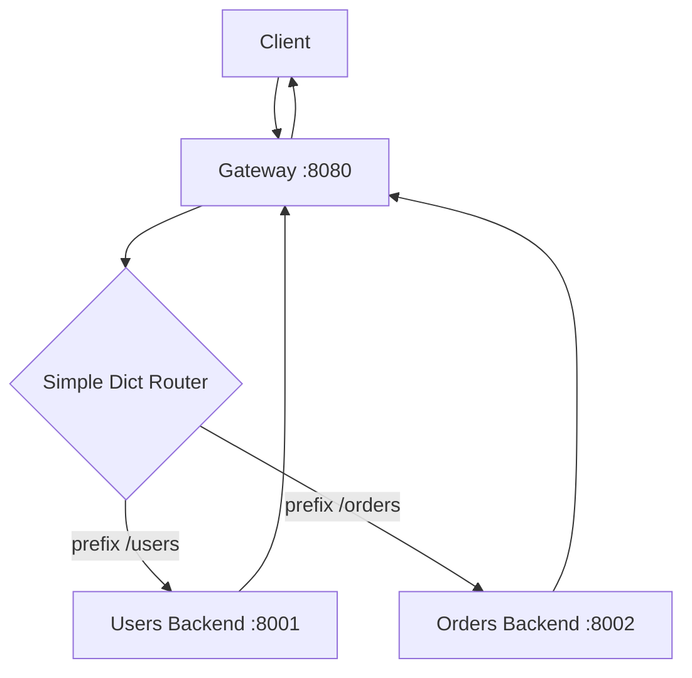

# pass_through

First working version of the gateway.

Super simple:

- recieve request
- routes are just a dict (via prefix)
- forwards the rest of the path + headers + body

Nothing fancy, just enough to get the gateway working end-to-end.

## How to run

1. Start the two backends
2. In a third terminal: `python api_gateway.py`

## architecture

