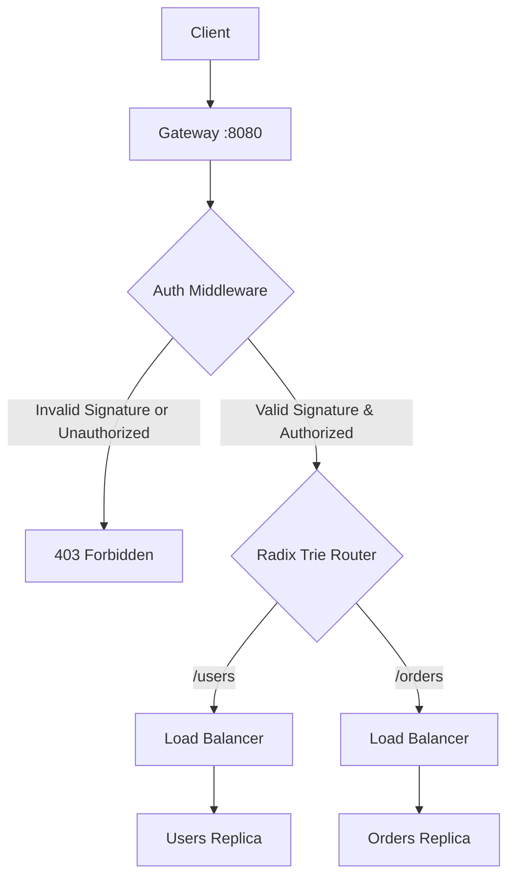

# authentication

Adds identity verification and prefix-based access control to the gateway. The gateway cryptographically validates JSON Web Tokens (JWT) at the edge and enforces role permissions before routing requests.

## What is being added and why?

In previous phases, anyone could hit `/orders` or `/users` endpoints unchallenged. Offloading authentication to the gateway means downstream microservices don't have to duplicate authentication logic, store cryptographic keys, or waste CPU cycles parsing tokens.

Instead of introducing heavy external dependencies (like `PyJWT` or `cryptography`), we implemented a zero-dependency **HMAC-SHA256 (HS256) JWT** verification engine using Python's standard library. 

### Core Concepts

**Edge Token Verification** - The gateway intercepts incoming requests, parses the case-insensitive `Authorization: Bearer <token>` header, and verifies the signature using `hmac.compare_digest` to prevent timing attacks.

**Role-Based Access Control (RBAC)** - Restricts access to specific path prefixes based on user roles embedded within the JWT claims:
*   `/users` (Public): Anyone can view.
*   `/orders`: Requires the `user` role.
*   `/_admin`: Requires the `admin` role.

---

## How to Run

### 1. Using the Makefile

```bash
# Start 6 backends + gateway (all-in-one)
make auth

# Open a new terminal and run the cryptographic verification benchmark
make auth-bench

# Kill everything when done
make stop-all
```

### 2. Playing with the Demo (Step-by-Step)

Because we use real cryptographically signed tokens, the signatures are evaluated live. 

1. Run `make auth` to start the services.
2. Observe your terminal output. On boot, the gateway generates and prints live, cryptographically valid user and admin tokens on boot:
3. Open `authentication/demo.http`.
4. Copy the printed user token from your terminal and paste it into the `@user_token =` variable at the top of the file.
5. Copy the printed admin token and paste it into the `@admin_token =` variable.
6. Click around the "Send Request" buttons to watch the gateway dynamically permit or block access:
   *   Accessing `/users` will succeed anonymously.
   *   Accessing `/orders` with the `user_token` will succeed, but will return a `403 Forbidden` with no token or an invalid token.
   *   Accessing `/_admin/status` with `user_token` will return a `403 Forbidden` (role mismatch), but will succeed when using the `admin_token`.

---

## Architecture

