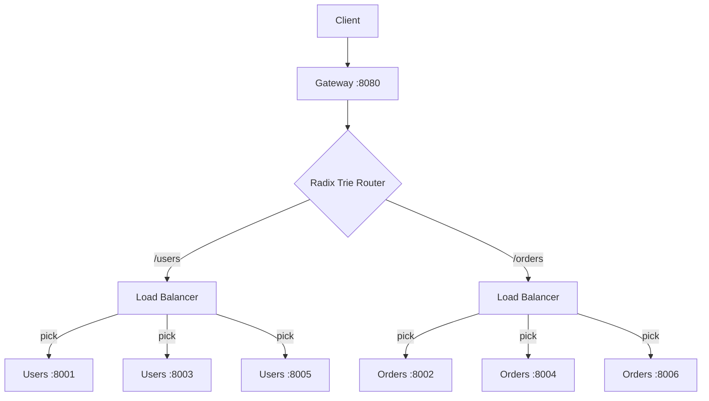

# load_balancing

Adds load balancing to the gateway. Each route prefix now fans out to multiple backend instances, and the gateway picks one per request.

## What is being added and why?

In `trie_routing` we could find the right service fast, but each prefix pointed to a single server. Real gateways need to spread traffic across replicas to handle failure and scale horizontally.

### Strategies Implemented (Naive -> Less Naive)

**Round Robin** - cycles through backends blindly. Simple but conflates request with load.

**Least Connections** - tracks in-flight requests per backend and always picks the one with the fewest. Naturally adapts when one server is slower or under heavy load; no tuning needed.
Issues include same user requests routed to different servers, eliminating server-level synergies.

**Consistent Hashing** - places servers on a hash ring. A request's path is hashed to a point on the ring, then walks clockwise to the first server. Same path always hits the same server (useful for caching), and removing a server only remaps ~1/N of keys instead of reshuffling everything. Introduces 'sticky sessions' to benefit from user - req lvl synergies.

### Why Virtual Nodes?

With raw consistent hashing (1 point per server), distribution is terrible - some servers get 3x the traffic of others. **Virtual nodes** give each server many points spread across the ring. At ~150 vnodes per server the distribution becomes nearly uniform, and failure remapping stays close to the theoretical minimum.

### Failure Handling

When a proxied request gets a `ConnectError`, the gateway:

1. Marks that backend as down
2. Asks the load balancer for a fallback
3. Retries once on the fallback

Admin endpoints let you simulate failures without actually killing processes:

- `POST /_admin/down/{port}` - mark a backend as unhealthy
- `POST /_admin/up/{port}` - restore it
- `GET /_admin/status` - see healthy/down state and active connections

## How to run

### Manual

```bash
# Terminal 1-6: start backends
python backend.py 8001 users
python backend.py 8003 users
python backend.py 8005 users
python backend.py 8002 orders
python backend.py 8004 orders
python backend.py 8006 orders

# Terminal 7: start gateway
python api_gateway.py

# Terminal 8: click around in demo.http, or:
curl http://localhost:8080/users/profile/123
curl http://localhost:8080/_admin/status
```

## How to Run

1. Start 6 backends + gateway on :8080 with `make lb`
2. Open `load_balancing/demo.http` and click around.
3. Run `make lb-bench` for the algorithm benchmark (no servers needed).
4. Run `make lb-chaos` for the automated chaos demo (starts its own servers).
5. Kill everything with `make lb-stop`.

## Architecture


