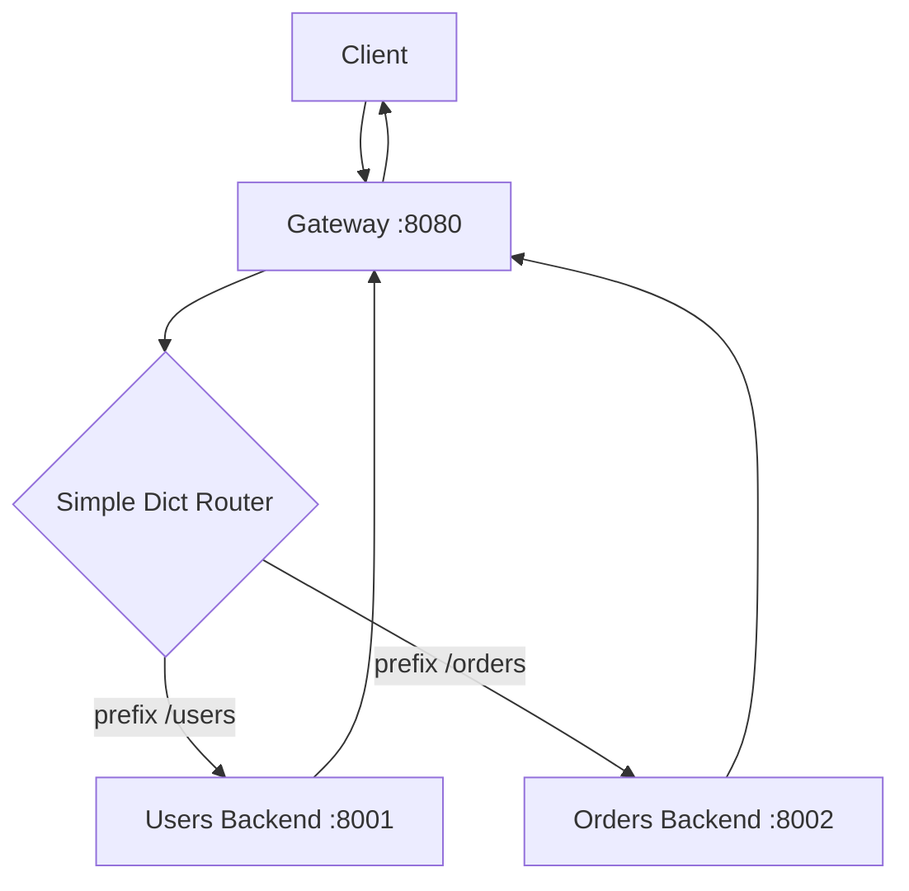

# pass_through

First working version of the gateway.

Super simple:

- recieve request
- routes are just a dict (via prefix)
- forwards the rest of the path + headers + body

Nothing fancy, just enough to get the gateway working end-to-end.

## How to Run

1. Start backends + gateway on :8080 with `make pass-through`
2. Open `pass_through/demo.http` and click around.
3. Kill gateway via `make pass-through-stop`.
4. Kill everything with `make stop-all`

## architecture

