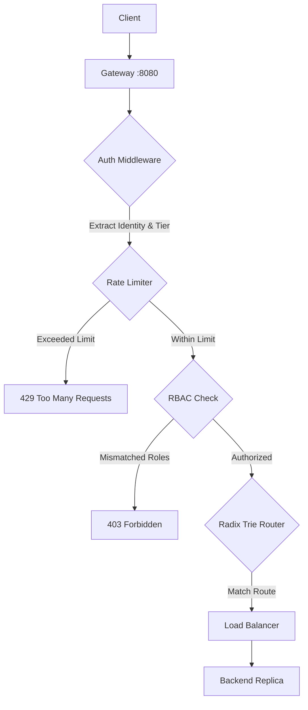

# rate_limiting

Adds tiered rate limiting to the gateway using the Token Bucket algorithm. The gateway dynamically applies different throughput thresholds depending on the identity and subscription tier extracted from verified JWT claims.

## What is being added and why?

Protecting backend services from abuse and DDoS attacks requires rate limiting. However, relying purely on IP-based rate limiting is unreliable:
1.  **NAT/Shared Networks**: An entire office or home network sharing a single external IP can hit the rate limit due to a single noisy user.
2.  **Mobile Clients**: Mobile devices frequently change IP addresses as they transition between cell towers and Wi-Fi networks.

### Tiered Token Bucket

Because our gateway decodes and verifies JWTs *before* the rate-limiting step, we can rate-limit based on the validated user identity (`user_id`) instead of the client's IP. 

The gateway dynamically matches users to one of three throughput tiers:

*   **`anonymous`** (fallback for unauthenticated traffic): Keyed by client IP. Capacity of 5 tokens, refilling at 1 token per second.
*   **`basic`** (authenticated users): Keyed by verified `user_id`. Capacity of 10 tokens, refilling at 2 tokens per second.
*   **`premium`** (authenticated admins): Keyed by verified `user_id`. Capacity of 30 tokens, refilling at 5 tokens per second.

When a client exceeds their limit, the gateway rejects the request immediately at the edge with a `429 Too Many Requests` status, injecting standard compliance headers like `Retry-After`, `X-RateLimit-Limit`, and `X-RateLimit-Remaining` to tell clients when they can try again.

---

## How to Run

### 1. Using the Makefile

```bash
# Start 6 backends + rate-limited gateway (all-in-one)
make limit

# Open a new terminal and run the Token Bucket decision benchmark
make limit-bench

# Kill everything when done
make stop-all
```

### 2. Playing with the Demo (Step-by-Step)

1. Start the services by running `make limit`.
2. Look at the terminal output. Copy the live user and admin tokens generated on startup.
3. Open `rate_limiting/demo.http`.
4. Paste your copied user token into the `@user_token =` variable at the top, and the admin token into the `@admin_token =` variable.
5. Send requests rapidly to test the threshold tiers:
   *   **Anonymous**: Click the first request (unauthenticated) 6 times rapidly. The 6th request will be blocked with a `429` error. Observe the `Retry-After` header.
   *   **Basic**: Send the second request (using user token) 11 times rapidly to hit the threshold.
   *   **Premium**: Send the third request (using admin token) 31 times rapidly to exhaust the highest tier capacity.

---

## Architecture

This shows the unified gateway middleware processing pipeline:

