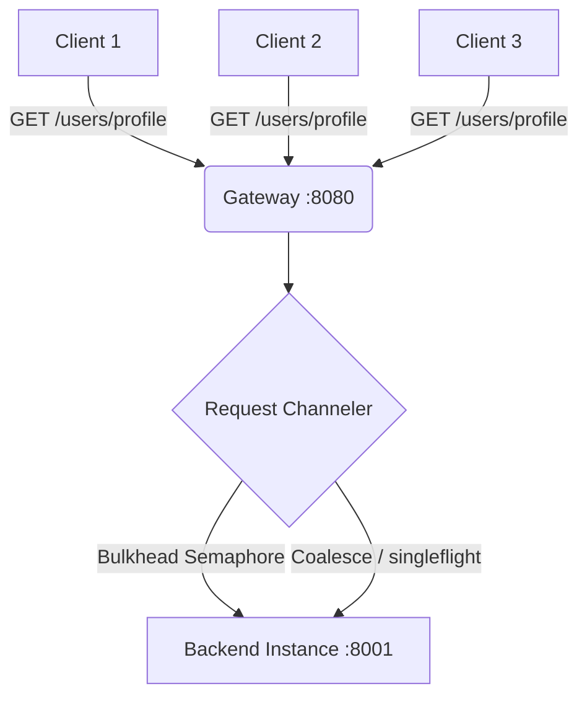

This file introduces request channeling, documents how the architectural components protect downstream servers, and contains run instructions.

# req_chanelling

Adds request flow control to the gateway using bulkhead isolation and request coalescing (singleflighting).

## What is being added and why?

In high-concurrency environments, naive load balancing can still expose backends to two critical failure modes:

1. **The Thundering Herd / Cache Stampede**: When a cache expires or a popular endpoint (e.g. a flash sale page) is hit concurrently by thousands of clients, the gateway forwards every single request downstream. This can crash databases or backend instances.
2. **Cascading Sluggishness**: If a backend instance slows down, the gateway can exhaust its own connection pool, file descriptors, and memory trying to hold open thousands of slow, pending connections.

### Strategies Implemented

**Bulkhead Concurrency Limiter** - Sets a maximum limit on active concurrent connections allocated to any single backend instance (using `asyncio.Semaphore`). If the limit is reached, incoming requests queue up rather than hammering the backend. This isolates failures and provides backpressure.

**Request Coalescing (Singleflight)** - Groups identical concurrent `GET` requests (keyed by method, path, and query parameters) while a downstream call is already in flight. The gateway executes only **one** request to the backend. When that single request returns, all waiting clients are served with the identical response simultaneously.

---

## How to Run

1. Start 6 backends + request-channeled gateway on :8080: `make rc`
2. Open `req_chanelling/demo.http` and click around.
3. Run the concurrency and coalescing benchmark: `make rc-bench`
4. Clean up all running services: `make rc-stop`

## Architecture
