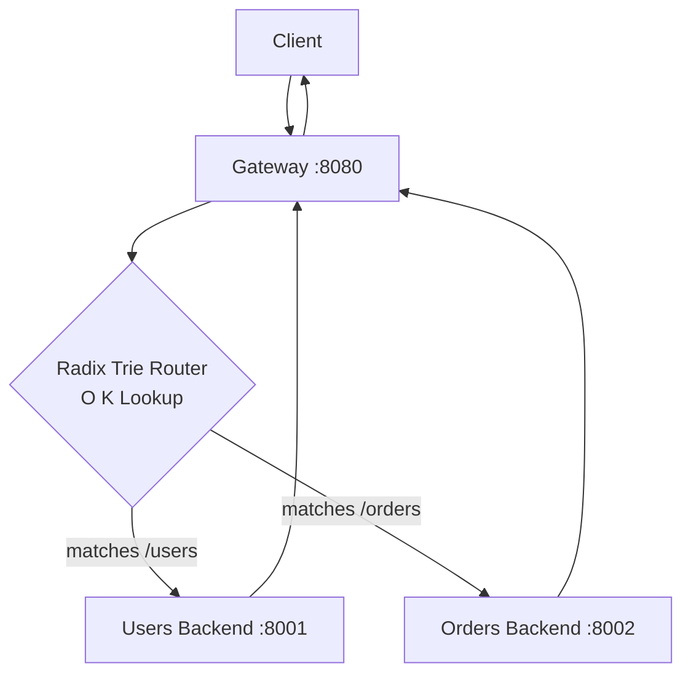

# trie_routing

Replaces our naive dictionary router with a Radix Trie.

## What is being added and why?

In the `pass_through` phase, we used a `dict` and looped through every route to find a match. Dictionary routing is $O(N)$ per request.

A Radix Trie. Lookup time becomes $O(K)$, where $K$ is the number of segments in the URL path. Whether you have 10 routes or 100,000 routes, a request to `/users/profile` only takes 2 node hops.

### Why a Radix Trie vs Standard Trie?

A **Standard Trie** allocates one node per character (`/` -> `u` -> `s` -> `e` -> `r` -> `s`). This uses massive amounts of memory and requires chasing dozens of pointers, which ruins CPU cache locality.

A **Radix Trie** compresses nodes with single children. For HTTP gateways, the most effective implementation is a **Segment Trie**, where the tree is compressed by path segments (`/users` -> `profile`). This keeps the tree shallow and lightning fast.

### Handling Wildcards (`*` or `:id`)

Because we compressed the tree by path segments, wildcards become incredibly easy to implement.

If a request comes in for `/users/99/profile`, the router checks the `users` node. If it doesn't find a `99` child, it simply checks if a `*` (wildcard) fallback child exists, and traverses down that branch instead.

### Updating the Trie (Concurrency)

API Gateways have highly asymmetric workloads: they are **Read-Heavy** (routing millions of requests) and **Write-Rarely** (adding new routes only when a new microservice is deployed).

Instead of wrapping the Trie in complex locks (which slows down reads), gateways use an **Atomic Swap**. When a new route is added, we build a brand *new* Trie in the background, and instantly swap the pointer: `self.router = new_trie`. Reads are never blocked!

## How to run

1. Start the two backends and in a third terminal launch the gateway.
2. Open demo.http and click around

## Architecture Update

